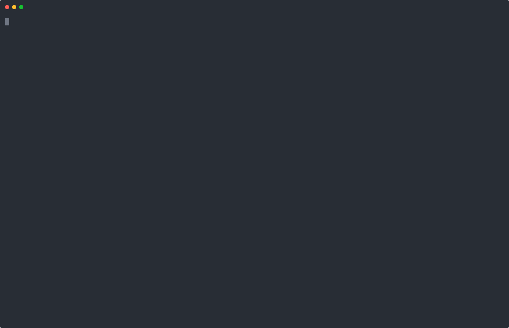

# Token-Efficient Change Detection in LLM APIs

Code for the paper [**Token-Efficient Change Detection in LLM APIs**](https://arxiv.org/abs/2602.11083) (ICML 2026). See also the [blog post](https://tchauvin.com/change-detection-llm-apis).

LLM APIs are opaque black boxes, even for open-weight models. Can we continuously monitor them for changes? Existing methods are either too expensive for deployment at scale, or require initial white-box access to model weights or grey-box access to log probabilities. **Black-Box Border Input Tracking (B3IT)** achieves both low cost and strict black-box operation, observing only output tokens: it reduces costs by 30× compared to existing methods, only requesting a single token of output at a time, with very short prompts.

## How it works

The idea is to identify **Border Inputs**, for which sampling at T=0 doesn't always give the same output (looking only at the first token of output). Example, recorded against `mistral-7b-instruct-v0.3` on Together: the single-token prompt `'hike'` answered `' H'` 2 times out of 3, and `' Title'` once. Border Inputs can easily be found just from black-box sampling, trying thousands of short inputs and keeping the border inputs. Then, being at T=0 makes any change in the model likely to move this border and result in a notably different output distribution when we sample each Border Input a few times.

Concretely, B3IT runs in two phases:

1. **Phase 1 — find Border Inputs.** Try thousands of single-token prompts (3 queries each) and keep the Border Inputs; sample each ~100× to estimate its reference output distribution, and keep the most balanced ones.
2. **Phase 2 — monitor.** Re-sample the selected Border Inputs daily and compare each day's output distributions to the reference (mean total variation distance). A sustained deviation from the trailing baseline flags a change.

## Demo: replay a real detection

Did you know that if you had something running on `mistral-7b-instruct-v0.3` from Together AI, they redirected it to the entirely different `Ministral-3-14B-Instruct-2512` in January 2026? If you were using the model through OpenRouter like us, you wouldn't have known, as even [OpenRouter seemingly hadn't been notified of the change](https://x.com/pingToven/status/2035724769413202148). The demo replays the full pipeline on the **real data recorded by our production monitor** as it caught this change.

Requires only [uv](https://docs.astral.sh/uv/):

```bash
cd b3it_demo
uv run b3it-demo
```



The detection code in the demo (`detection.py`, `analyze.py`) is vendored unchanged from the production monitor, with its production configuration (as of 2026-07-19); the replayed data is the monitor's raw recorded samples.

## Repository layout

The paper's code comes from two codebases, included here as separate packages, plus the demo:

| Directory | Contents |
|---|---|
| [`b3it_monitoring/`](b3it_monitoring/) | The B3IT monitoring pipeline as deployed against live endpoints (phase 1 discovery, phase 2 monitoring, analysis) — the paper's in-vivo experiments (source: [trackllm_website](https://github.com/timothee-chauvin/trackllm_website)) |
| [`track-llm-apis/`](track-llm-apis/) | In-vitro experiments: vLLM sampling of deliberately modified models (TinyChange) (source: [track-llm-apis](https://github.com/timothee-chauvin/track-llm-apis)) |
| [`b3it_demo/`](b3it_demo/) | The demo above: terminal replay of the pipeline on real recorded data |

## Citation

```bibtex
@inproceedings{
chauvin2026tokenefficient,
title={Token-Efficient Change Detection in {LLM} {API}s},
author={Timothee Chauvin and Cl{\'e}ment Lalanne and Erwan Le Merrer and Jean-Michel Loubes and Francois Taiani and Gilles Tredan},
booktitle={Forty-third International Conference on Machine Learning},
year={2026},
url={https://openreview.net/forum?id=7cMlZZYZT0}
}
```
